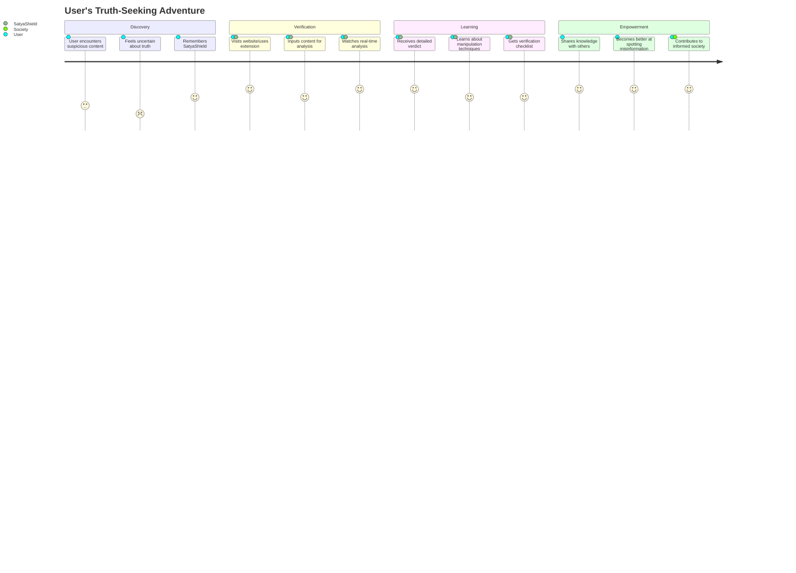

# 🌟 SatyaShield Frontend

<div align="center">
  
  > *"In a world full of noise, we are the signal."*

  [](https://nextjs.org/)
  [](https://reactjs.org/)
  [](https://tailwindcss.com/)

</div>

---

## 🎪 The Experience

<div align="center">

```ascii
    🌊 Dive into the ocean of information
         🏄‍♀️ Surf with confidence
              🛡️ Protected by SatyaShield
```

</div>

Welcome to the **visual heartbeat** of India's fight against misinformation! Our frontend isn't just a website—it's a **digital sanctuary** where truth seekers gather, where skepticism meets science, and where every citizen becomes a fact-checking superhero.

---

## 🎨 Design Philosophy

<table>
<tr>
<td width="50%">

### 🌈 **Visual Poetry**
Our interface speaks the language of trust through:
- **Glassmorphism Effects** that make data feel tangible
- **Micro-animations** that guide user attention naturally  
- **Dark/Light Modes** that adapt to user preferences
- **Gradient Magic** that makes verification feel delightful

</td>
<td width="50%">

### ⚡ **Lightning Performance**
Built for the speed of misinformation:
- **Sub-second Load Times** with Next.js optimization
- **Progressive Loading** for complex analyses
- **Offline Capabilities** for uninterrupted fact-checking
- **Mobile-First Design** for India's mobile-dominant users

</td>
</tr>
</table>

---

## 🚀 Quick Launch Sequence

```bash
# 🌟 Clone the magic
git clone https://github.com/Satya-Shield/Frontend.git
cd Frontend

# 📦 Install the superpowers
npm install
# or for the adventurous
yarn install
# or for the speed demons
pnpm install

# 🔥 Ignite the development server
npm run dev

# 🎉 Open http://localhost:3000 and witness the magic!
```

<div align="center">

```
🎊 CONGRATULATIONS! 🎊
Your SatyaShield frontend is now live and ready to fight misinformation!
```

</div>

---

## 🎯 User Journey Map



---

## 🛠️ Tech Stack Superpowers

<div align="center">

```
      🏗️ ARCHITECTURE FORTRESS 🏗️
      
    ┌─────────────────────────────────────┐
    │           Next.js 14+               │
    │        (App Router Magic)           │
    └─────────────┬───────────────────────┘
    ┌─────────────▼───────────────────────┐
    │          React 18+                  │
    │     (Concurrent Features)           │
    └─────────────┬───────────────────────┘
    ┌─────────────▼───────────────────────┐
    │       Tailwind CSS                  │
    │    (Styling Superpowers)            │
    └─────────────────────────────────────┘
```

</div>

---

## 📷 Scrrenshots

---

## 🎊 Community & Ecosystem

### 🌐 **The SatyaShield Universe**

<div align="center">

```
         🌟 Frontend (You are here!)
              ⬆️ ⬇️
    🔧 Extension ← 🤖 Backend → 💬 WhatsApp Bot
              ⬆️ ⬇️
         👥 Community Platform
```

</div>

| 🏠 Home Base | 🔗 Portal | 🎯 Mission |
|--------------|-----------|------------|
| **Frontend** | *This Repo* | Beautiful user experiences |
| **Backend** | [API Engine](https://github.com/Satya-Shield/Backend) | AI-powered verification |
| **Extension** | [Browser Tool](https://github.com/Satya-Shield/Browser-Extension) | One-click verification |
| **WhatsApp** | [Messaging Bot](https://github.com/Satya-Shield/Whatsapp-Bot) | Instant fact-checking |

---

## 🎪 Contributing to the Magic

We believe in **collective intelligence**! Here's how you can join our truth-seeking mission:

<div align="center">

```
🎭 CONTRIBUTION THEATER 🎭

   🎨 Design Wizards    🧙‍♂️ Code Sorcerers    📝 Content Creators
        │                     │                      │
        ▼                     ▼                      ▼
   UI/UX Magic         Feature Development      Educational Content
        │                     │                      │
        └─────────────────────┼─────────────────────┘
                              ▼
                      🌟 Better SatyaShield 🌟
```

</div>

### 🎨 **For Designers**
- Create stunning animations and micro-interactions
- Design new verification visualization methods
- Improve accessibility and user experience
- Craft beautiful error and loading states

### 💻 **For Developers**
- Optimize performance and bundle size
- Add new interactive components
- Implement advanced React patterns
- Enhance mobile experience

### 📝 **For Content Creators**
- Write educational content about misinformation
- Create interactive tutorials and guides
- Develop quiz questions and challenges
- Translate content for regional languages

---

## 🎊 The Grand Finale

<div align="center">

**[⭐ Star this repository](https://github.com/Satya-Shield/Frontend)** if you believe in the power of truth!

**[🍴 Fork and contribute](https://github.com/Satya-Shield/Frontend/fork)** to join our mission!

**[📢 Share with friends](https://twitter.com/intent/tweet?text=Check%20out%20SatyaShield%20-%20AI-powered%20misinformation%20detection!%20%23TruthMatters%20%23DigitalLiteracy)** to spread awareness!

</div>

<div align="center">

*"The best way to fight misinformation is not to silence it, but to illuminate the truth so brightly that lies have nowhere to hide."*

**Made with 💖, ☕, and countless nights by the SatyaShield Team**

---

**🔗 Quick Links:** [Backend](https://github.com/Satya-Shield/Backend) • [Extension](https://github.com/Satya-Shield/Browser-Extension) • [WhatsApp Bot](https://github.com/Satya-Shield/Whatsapp-Bot) • [Documentation](https://docs.satyashield.com)

</div>
